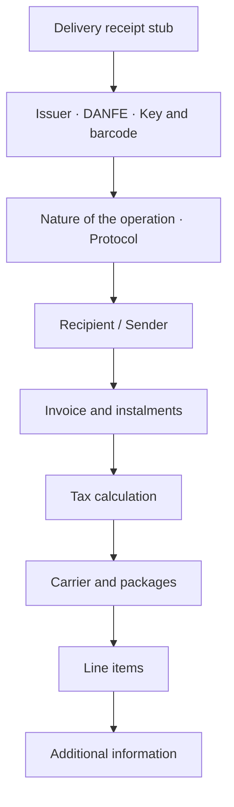
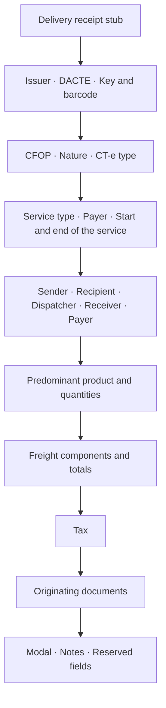
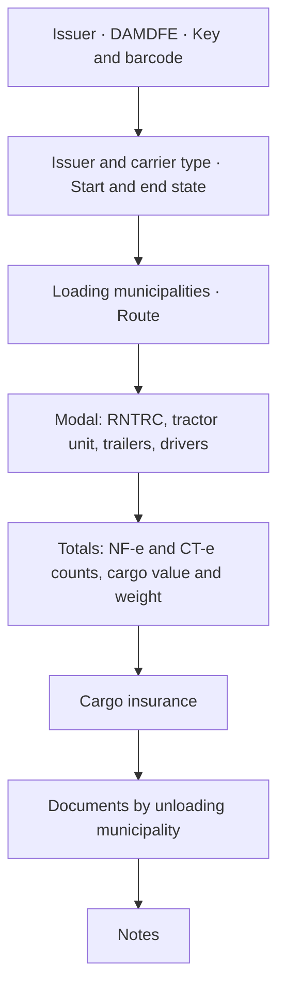

# Auxiliary documents as PDF

The [`danfe`](https://pkg.go.dev/github.com/mschunke/gonfe/danfe) package
generates the five auxiliary documents as PDFs.

| Auxiliary document | Fiscal document | Function | Format |
| --- | --- | --- | --- |
| DANFE | NF-e, model 55 | `Gerar` or `DANFE` | A4 |
| Receipt | NFC-e, model 65 | `Gerar` or `Cupom` | till roll |
| DACTE | CT-e, model 57 | `GerarDACTE` or `DACTE` | A4 |
| DACTE OS | CT-e OS, model 67 | `GerarDACTEOS` or `DACTEOS` | A4 |
| DAMDFE | MDF-e, model 58 | `GerarDAMDFE` or `DAMDFE` | A4 |

```go
proc, _ := os.ReadFile("43260...-procNFe.xml")

documento, err := danfe.Gerar(proc, danfe.Opcoes{})
if err != nil {
    return err
}
os.WriteFile("danfe.pdf", documento, 0o644)
```

The `Gerar*` functions take the distribution XML — `nfeProc`, `cteProc`,
`cteOSProc` or `mdfeProc` — and handle the parsing. `Gerar` additionally chooses
between DANFE and receipt by model: 55 becomes a DANFE, 65 becomes a receipt.
When the document is already parsed in memory, call `DANFE`, `Cupom`, `DACTE`,
`DACTEOS` or `DAMDFE` directly, passing the document and the protocol.

All of them accept the same [options](#opcoes) and paginate automatically.

## No dependencies

The PDF is written in pure Go, using the base-14 fonts every reader already has.
There is no graphics library, no CGO, no embedded font file — the module still
has a single external dependency, the PKCS#12 one.

The Code 128 barcode of the access key is drawn as rectangles, with no barcode
library.

!!! warning "On fidelity to the manual"

    The five layouts follow the **block structure** of the technical
    specification manuals, in the order those manuals describe. None is a
    millimetre-accurate reproduction of the official form, and none has been
    visually approved by any SEFAZ.

    Print a sample and check it against your state's requirements before using
    it in production:

    ```bash
    go run ./exemplos/danfe -amostra
    ```

## What the DANFE contains



Pagination is automatic: long invoices take as many sheets as needed, with the
header repeated and "FOLHA n de N" numbering. The identification blocks appear
only on the first sheet; the additional information, only on the last.

## The DACTE

```go
proc, _ := os.ReadFile("43260...-procCTe.xml")

dacte, err := danfe.GerarDACTE(proc, danfe.Opcoes{})
```



Two behaviours that save work:

- **The payer is resolved automatically.** When `toma3` points at the sender,
  the dispatcher, the receiver or the recipient, the payer block is filled with
  that party's details. A `toma4` is used as given.
- **The key fills the table.** In the originating documents, the issuer's CNPJ,
  the series and the number come from the transported NF-e's own access key.

## The DACTE OS

```go
dacteos, err := danfe.GerarDACTEOS(procCTeOS, danfe.Opcoes{})
```

Where the DACTE describes cargo and transported documents, the DACTE OS
describes a payer, the service in free text, the vehicle and the referenced
documents — passenger tickets and GTV-e, which share one table.

It has **no receipt stub**: there are no packages to receive, so there is no
delivery receipt, and `SemCanhoto` is ignored.

## The DAMDFE

```go
proc, _ := os.ReadFile("43260...-procMDFe.xml")

damdfe, err := danfe.GerarDAMDFE(proc, danfe.Opcoes{})
```



The DAMDFE has no receipt stub — what gets signed for on delivery are the
documents it lists, not the manifest — so `SemCanhoto` is ignored. In the
document list the municipality appears only on the first row of each group;
repeating it on every key would turn the column into noise.

The footer reminds you that the manifest must be closed out. That is not
decoration: an open MDF-e blocks the next one from being issued, and the printed
reminder reaches the driver, who is the one standing in the yard.

## Options

```go
danfe.Opcoes{
    Orientacao:    danfe.Paisagem,  // default: portrait
    SemCanhoto:    true,            // omits the delivery receipt stub
    Cancelada:     true,            // prints the cancellation banner
    Homologacao:   true,            // forces the test banner
    Mensagem:      "Emitido por Sistema X",
    LarguraBobina: 58,              // NFC-e: 80 mm by default
    QRCode:        matriz,          // NFC-e: see below
}
```

The banners appear on their own when the document calls for them: an invoice in
homologation gets `SEM VALOR FISCAL`, a denied one gets `USO DENEGADO`, and one
without a protocol gets `SEM AUTORIZAÇÃO`.

`Orientacao` rotates the sheet and gives the blocks more width. In the transport
documents the structure drawn is the same in both orientations — it is not the
dedicated landscape layout the DACTE manual describes, and the document's
`tpImp` field is not consulted.

## The NFC-e QR Code

The library produces the QR Code **text** — the URL with its parameters and hash
— but does not encode it into an image. Encoding QR is a domain of its own, with
Reed-Solomon error correction and masking; a poorly tested implementation of our
own would be worse than none.

Pass in the finished matrix, obtained from the QR library of your choice:

```go
import "github.com/skip2/go-qrcode"

q, err := qrcode.New(n.InfNFeSupl.QrCode, qrcode.Medium)
if err != nil {
    return err
}

cupom, err := danfe.Cupom(n, prot, danfe.Opcoes{
    QRCode: danfe.MatrizQR(q.Bitmap()),
})
```

Without the matrix, the receipt comes out with the lookup URL in text and a note
saying the QR Code was not included — readable, but missing the square the
consumer points a camera at.

## The NFC-e receipt

The receipt does not paginate: it comes out as one continuous strip, with its
height computed from the content. The default width is 80 mm, that of the usual
thermal printers; `LarguraBobina` accepts 58 mm and other formats.

```go
cupom, err := danfe.Cupom(n, prot, danfe.Opcoes{
    LarguraBobina: 58,
    QRCode:        matriz,
})
```

The content follows what the NFC-e Technical Note requires: issuer
identification, line items with quantity and unit price, totals, payment
methods, total taxes under Law 12.741/2012, consumer identification, access key,
QR Code and authorisation protocol.

## Printing

The PDF comes out ready to print. On a thermal printer, send the file straight
to the device or convert it with the manufacturer's tool — the page already has
the exact width of the roll, so there is no rescaling.

To serve the document over HTTP:

```go
func baixarDANFE(w http.ResponseWriter, r *http.Request) {
    documento, err := danfe.Gerar(proc, danfe.Opcoes{})
    if err != nil {
        http.Error(w, err.Error(), http.StatusInternalServerError)
        return
    }
    w.Header().Set("Content-Type", "application/pdf")
    w.Header().Set("Content-Disposition", `inline; filename="danfe.pdf"`)
    w.Write(documento)
}
```

## Samples

```bash
go run ./exemplos/danfe -amostra
```

Generates all five files — `amostra-danfe.pdf`, `amostra-cupom.pdf`,
`amostra-dacte.pdf`, `amostra-dacte-os.pdf` and `amostra-damdfe.pdf` — from
demonstration documents, with no certificate and no XML required. It is the
quickest way to judge the layout.

To generate from a real XML, the same command serves them all: the type is
recognised from the root element.

```bash
go run ./exemplos/danfe -xml ./43260...-procCTe.xml
```
