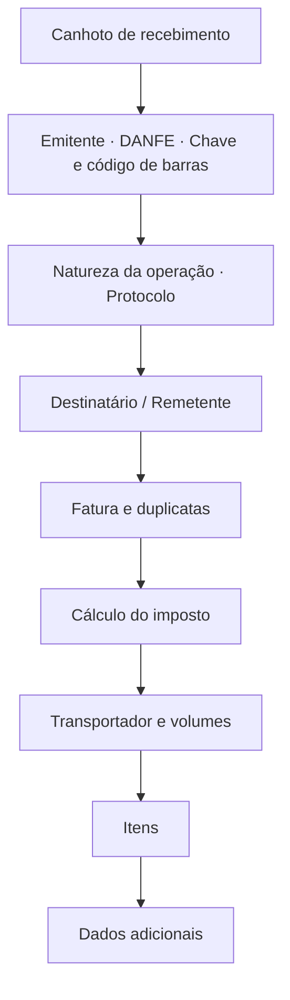
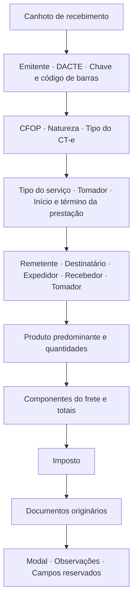
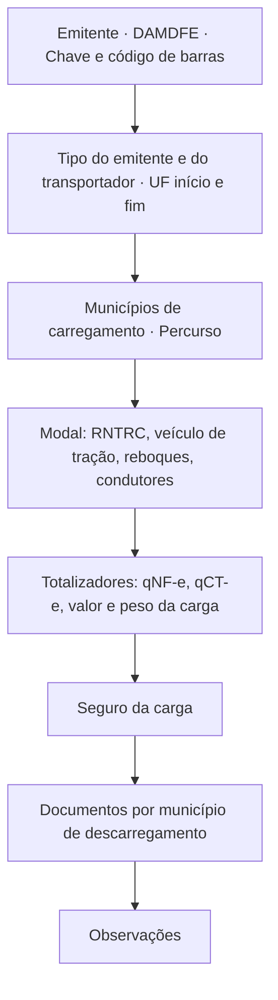

# Documentos auxiliares em PDF

O pacote [`danfe`](https://pkg.go.dev/github.com/mschunke/gonfe/danfe) gera os
cinco documentos auxiliares em PDF.

| Documento auxiliar | Documento fiscal | Função | Formato |
| --- | --- | --- | --- |
| DANFE | NF-e, modelo 55 | `Gerar` ou `DANFE` | A4 |
| Cupom | NFC-e, modelo 65 | `Gerar` ou `Cupom` | bobina |
| DACTE | CT-e, modelo 57 | `GerarDACTE` ou `DACTE` | A4 |
| DACTE OS | CT-e OS, modelo 67 | `GerarDACTEOS` ou `DACTEOS` | A4 |
| DAMDFE | MDF-e, modelo 58 | `GerarDAMDFE` ou `DAMDFE` | A4 |

```go
proc, _ := os.ReadFile("43260...-procNFe.xml")

documento, err := danfe.Gerar(proc, danfe.Opcoes{})
if err != nil {
    return err
}
os.WriteFile("danfe.pdf", documento, 0o644)
```

As funções `Gerar*` recebem o XML de distribuição — `nfeProc`, `cteProc`,
`cteOSProc` ou `mdfeProc` — e cuidam da leitura. `Gerar` ainda escolhe entre
DANFE e cupom pelo modelo: 55 vira DANFE, 65 vira cupom. Quando o documento já
está interpretado em memória, chame `DANFE`, `Cupom`, `DACTE`, `DACTEOS` ou
`DAMDFE` diretamente, passando o documento e o protocolo.

Todos aceitam as mesmas [opções](#opcoes) e produzem paginação automática.

## Sem dependências

O PDF é escrito em Go puro, com as fontes base-14 que todo leitor já possui. Não
há biblioteca gráfica, não há CGO, não há arquivo de fonte embutido — o módulo
continua com uma única dependência externa, a de PKCS#12.

O código de barras Code 128 da chave de acesso é desenhado como retângulos, sem
biblioteca de barcode.

!!! warning "Sobre a fidelidade ao manual"

    Os cinco leiautes seguem a **estrutura de blocos** dos manuais de
    especificação técnica, na ordem que eles descrevem. Nenhum é uma reprodução
    milimétrica do formulário oficial, e nenhum passou por homologação visual em
    SEFAZ alguma.

    Imprima uma amostra e confira contra as exigências da sua unidade da
    federação antes de usar em produção:

    ```bash
    go run ./exemplos/danfe -amostra
    ```

## O que sai no DANFE



A paginação é automática: notas longas ocupam quantas folhas forem necessárias,
com o cabeçalho repetido e a numeração "FOLHA n de N". Os blocos de
identificação aparecem só na primeira folha; os dados adicionais, só na última.

## O DACTE

```go
proc, _ := os.ReadFile("43260...-procCTe.xml")

dacte, err := danfe.GerarDACTE(proc, danfe.Opcoes{})
```



Dois detalhes de comportamento que economizam trabalho:

- **O tomador é resolvido sozinho.** Quando o `toma3` aponta para o remetente, o
  expedidor, o recebedor ou o destinatário, o bloco do tomador é preenchido com
  os dados daquela parte. Um `toma4` é usado como está.
- **A chave preenche a tabela.** Nos documentos originários, o CNPJ do emitente,
  a série e o número saem da própria chave de acesso da NF-e transportada.

## O DACTE OS

```go
dacteos, err := danfe.GerarDACTEOS(procCTeOS, danfe.Opcoes{})
```

Onde o DACTE descreve carga e documentos transportados, o DACTE OS descreve um
tomador, o serviço em texto livre, o veículo e os documentos referenciados —
bilhetes de passagem e GTV-e, que saem na mesma tabela.

Ele **não tem canhoto**: não há volumes a receber, então não há recibo de
entrega, e `SemCanhoto` é ignorada.

## O DAMDFE

```go
proc, _ := os.ReadFile("43260...-procMDFe.xml")

damdfe, err := danfe.GerarDAMDFE(proc, danfe.Opcoes{})
```



O DAMDFE não tem canhoto — quem assina o recebimento são os documentos que ele
relaciona, não o manifesto —, então `SemCanhoto` é ignorada. Na relação de
documentos, o município aparece só na primeira linha de cada grupo; repeti-lo em
cada chave transformaria a coluna em ruído.

O rodapé lembra que o manifesto precisa ser encerrado. Não é decoração: um MDF-e
em aberto bloqueia a emissão do seguinte, e o lembrete impresso chega ao
motorista, que é quem está no pátio.

## Opções

```go
danfe.Opcoes{
    Orientacao:    danfe.Paisagem,  // padrão: retrato
    SemCanhoto:    true,            // omite o recibo de entrega
    Cancelada:     true,            // imprime a tarja de cancelamento
    Homologacao:   true,            // força a tarja de teste
    Mensagem:      "Emitido por Sistema X",
    LarguraBobina: 58,              // NFC-e: padrão 80 mm
    QRCode:        matriz,          // NFC-e: veja abaixo
}
```

As tarjas saem sozinhas quando o documento pede: uma nota em homologação recebe
`SEM VALOR FISCAL`, uma denegada recebe `USO DENEGADO` e uma sem protocolo
recebe `SEM AUTORIZAÇÃO`.

`Orientacao` gira a folha e dá mais largura aos blocos. Nos documentos do
transporte a estrutura desenhada é a mesma nas duas orientações — não é o
leiaute paisagem próprio que o manual do DACTE descreve, e o campo `tpImp` do
documento não é consultado.

## O QR Code da NFC-e

A biblioteca produz o **texto** do QR Code — a URL com os parâmetros e o hash —
mas não o codifica em imagem. Codificar QR é um domínio à parte, com correção de
erro Reed-Solomon e mascaramento; uma implementação própria mal testada seria
pior que nenhuma.

Passe a matriz pronta, obtida com a biblioteca de QR de sua preferência:

```go
import "github.com/skip2/go-qrcode"

q, err := qrcode.New(n.InfNFeSupl.QrCode, qrcode.Medium)
if err != nil {
    return err
}

cupom, err := danfe.Cupom(n, prot, danfe.Opcoes{
    QRCode: danfe.MatrizQR(q.Bitmap()),
})
```

Sem a matriz, o cupom sai com a URL de consulta em texto e um aviso de que o QR
Code não foi incluído — legível, mas sem o quadrado que o consumidor aponta a
câmera.

## O cupom da NFC-e

O cupom não pagina: ele sai em uma tira contínua, com a altura calculada a
partir do conteúdo. A largura padrão é 80 mm, a das impressoras térmicas usuais;
`LarguraBobina` aceita 58 mm e outros formatos.

```go
cupom, err := danfe.Cupom(n, prot, danfe.Opcoes{
    LarguraBobina: 58,
    QRCode:        matriz,
})
```

O conteúdo segue o que a NT da NFC-e pede: identificação do emitente, itens com
quantidade e valor unitário, totais, formas de pagamento, tributos totais pela
Lei 12.741/2012, identificação do consumidor, chave de acesso, QR Code e
protocolo de autorização.

## Imprimindo

O PDF sai pronto para impressão. Em impressora térmica, mande o arquivo direto
ao dispositivo ou converta com a ferramenta do fabricante — a página já tem a
largura exata da bobina, então não há reescala.

Para servir o documento por HTTP:

```go
func baixarDANFE(w http.ResponseWriter, r *http.Request) {
    documento, err := danfe.Gerar(proc, danfe.Opcoes{})
    if err != nil {
        http.Error(w, err.Error(), http.StatusInternalServerError)
        return
    }
    w.Header().Set("Content-Type", "application/pdf")
    w.Header().Set("Content-Disposition", `inline; filename="danfe.pdf"`)
    w.Write(documento)
}
```

## Amostras

```bash
go run ./exemplos/danfe -amostra
```

Gera os cinco arquivos — `amostra-danfe.pdf`, `amostra-cupom.pdf`,
`amostra-dacte.pdf`, `amostra-dacte-os.pdf` e `amostra-damdfe.pdf` — com
documentos de demonstração, sem precisar de certificado nem de XML. É o caminho
mais rápido para julgar o leiaute.

Para gerar a partir de um XML real, o mesmo comando serve a todos: o tipo é
reconhecido pelo elemento raiz.

```bash
go run ./exemplos/danfe -xml ./43260...-procCTe.xml
```
