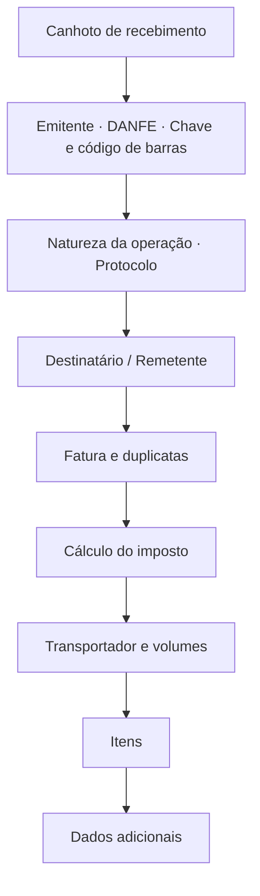

# DANFE e cupom

O pacote [`danfe`](https://pkg.go.dev/github.com/mschunke/gonfe/danfe) gera os
documentos auxiliares em PDF: o DANFE da NF-e, em A4, e o cupom da NFC-e, em
bobina.

```go
proc, _ := os.ReadFile("43260...-procNFe.xml")

documento, err := danfe.Gerar(proc, danfe.Opcoes{})
if err != nil {
    return err
}
os.WriteFile("danfe.pdf", documento, 0o644)
```

`Gerar` escolhe o formato pelo modelo do documento: modelo 55 vira DANFE,
modelo 65 vira cupom. Para controlar isso você mesmo, chame `DANFE` ou `Cupom`
diretamente, passando a nota e o protocolo já interpretados.

## Sem dependências

O PDF é escrito em Go puro, com as fontes base-14 que todo leitor já possui. Não
há biblioteca gráfica, não há CGO, não há arquivo de fonte embutido — o módulo
continua com uma única dependência externa, a de PKCS#12.

O código de barras Code 128 da chave de acesso é desenhado como retângulos, sem
biblioteca de barcode.

!!! warning "Sobre a fidelidade ao manual"

    O leiaute segue a **estrutura de blocos** do Manual de Especificação Técnica
    do DANFE — canhoto, emitente, destinatário, cálculo do imposto,
    transportador, itens e dados adicionais. Ele **não** é uma reprodução
    milimétrica do formulário oficial, e não passou por homologação visual em
    nenhuma SEFAZ.

    Imprima uma amostra e confira contra as exigências da sua unidade da
    federação antes de usar em produção:

    ```bash
    go run ./exemplos/danfe -amostra
    ```

## O que sai no DANFE



A paginação é automática: notas longas ocupam quantas folhas forem necessárias,
com o cabeçalho repetido e a numeração "FOLHA n de N". Os blocos de
identificação aparecem só na primeira folha; os dados adicionais, só na última.

## Opções

```go
danfe.Opcoes{
    Orientacao:    danfe.Paisagem,  // padrão: retrato
    SemCanhoto:    true,            // omite o recibo de entrega
    Cancelada:     true,            // imprime a tarja de cancelamento
    Homologacao:   true,            // força a tarja de teste
    Mensagem:      "Emitido por Sistema X",
    LarguraBobina: 58,              // NFC-e: padrão 80 mm
    QRCode:        matriz,          // NFC-e: veja abaixo
}
```

As tarjas saem sozinhas quando o documento pede: uma nota em homologação recebe
`SEM VALOR FISCAL`, uma denegada recebe `USO DENEGADO` e uma sem protocolo
recebe `SEM AUTORIZAÇÃO`.

## O QR Code da NFC-e

A biblioteca produz o **texto** do QR Code — a URL com os parâmetros e o hash —
mas não o codifica em imagem. Codificar QR é um domínio à parte, com correção de
erro Reed-Solomon e mascaramento; uma implementação própria mal testada seria
pior que nenhuma.

Passe a matriz pronta, obtida com a biblioteca de QR de sua preferência:

```go
import "github.com/skip2/go-qrcode"

q, err := qrcode.New(n.InfNFeSupl.QrCode, qrcode.Medium)
if err != nil {
    return err
}

cupom, err := danfe.Cupom(n, prot, danfe.Opcoes{
    QRCode: danfe.MatrizQR(q.Bitmap()),
})
```

Sem a matriz, o cupom sai com a URL de consulta em texto e um aviso de que o QR
Code não foi incluído — legível, mas sem o quadrado que o consumidor aponta a
câmera.

## O cupom da NFC-e

O cupom não pagina: ele sai em uma tira contínua, com a altura calculada a
partir do conteúdo. A largura padrão é 80 mm, a das impressoras térmicas usuais;
`LarguraBobina` aceita 58 mm e outros formatos.

```go
cupom, err := danfe.Cupom(n, prot, danfe.Opcoes{
    LarguraBobina: 58,
    QRCode:        matriz,
})
```

O conteúdo segue o que a NT da NFC-e pede: identificação do emitente, itens com
quantidade e valor unitário, totais, formas de pagamento, tributos totais pela
Lei 12.741/2012, identificação do consumidor, chave de acesso, QR Code e
protocolo de autorização.

## Imprimindo

O PDF sai pronto para impressão. Em impressora térmica, mande o arquivo direto
ao dispositivo ou converta com a ferramenta do fabricante — a página já tem a
largura exata da bobina, então não há reescala.

Para servir o documento por HTTP:

```go
func baixarDANFE(w http.ResponseWriter, r *http.Request) {
    documento, err := danfe.Gerar(proc, danfe.Opcoes{})
    if err != nil {
        http.Error(w, err.Error(), http.StatusInternalServerError)
        return
    }
    w.Header().Set("Content-Type", "application/pdf")
    w.Header().Set("Content-Disposition", `inline; filename="danfe.pdf"`)
    w.Write(documento)
}
```

## Amostras

```bash
go run ./exemplos/danfe -amostra
```

Gera `amostra-danfe.pdf` e `amostra-cupom.pdf` com uma nota de demonstração, sem
precisar de certificado nem de XML — o caminho mais rápido para julgar o
leiaute.

Para gerar a partir de um XML real:

```bash
go run ./exemplos/danfe -xml ./43260...-procNFe.xml
```
