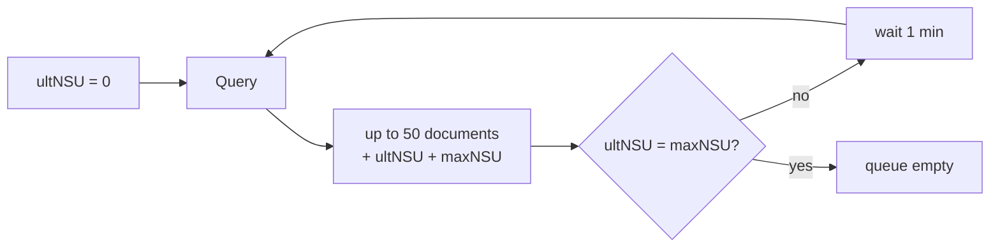

# DF-e distribution

DF-e distribution is the service through which the Receita delivers the fiscal
documents **of interest** to a CNPJ — including those third parties issued
against it. It is the only legitimate way to find out that a supplier issued an
invoice in your name.

## The queue

The service works as a numbered queue. Each document receives an **NSU**, and
the client asks for everything that came after the last NSU it consumed.



Each query returns at most fifty documents, the highest NSU returned (`ultNSU`)
and the highest NSU that exists in the database (`maxNSU`). When the two match,
the queue is exhausted.

!!! danger "Excessive polling blocks you for an hour"

    The Receita blocks callers who query too frequently — code 656. The block
    usually lasts an hour and applies to the whole CNPJ, not just to the process
    that got it wrong.

    The practical rules: **one minute** between queries while there is still a
    queue, and **one hour** between runs once you have drained it. `ConsumirDFe`
    honours the first interval on its own; the second is your scheduler's
    responsibility.

## Consuming the queue

```go
cliente, _ := sefaz.NovoCliente(sefaz.Config{
    UF: uf.RS, Ambiente: nfe.Producao,
    Modelo: nfe.ModeloNFe, Certificado: cert,
})

ultimoNSU := carregarDoBanco() // "0" on the first run

nsu, err := cliente.ConsumirDFe(ctx, ultimoNSU, func(d dfe.Documento) error {
    log.Println(d.Descrever())
    return gravar(d)
})
gravarNoBanco(nsu) // even on the error path
```

`ConsumirDFe` walks the queue to the end, calling your function once per
document. If the function returns an error, consumption stops and the NSU
returned is that of the **last document processed successfully** — so the next
run resumes exactly where it stopped, skipping nothing.

Always store the NSU, including on the error path. Losing it means re-consuming
the entire queue, which is slow and courts the excessive-polling block.

## What arrives in the queue

Four kinds of document, told apart by the `schema` field:

| Method | Schema | Content |
| --- | --- | --- |
| `EhResumoNFe()` | `resNFe` | Summary of an invoice issued against you |
| `EhNFeCompleta()` | `procNFe` | The whole invoice, with its protocol |
| `EhResumoEvento()` | `resEvento` | Summary of an event on an invoice of interest |
| `EhEventoCompleto()` | `procEventoNFe` | The event with its response |

```go
switch {
case d.EhResumoNFe():
    r, _ := d.ResumoNFe()
    fmt.Println(r.XNome, r.VNF, r.Autorizada())

case d.EhNFeCompleta():
    n, prot, _ := d.NFe()
    fmt.Println(n.Chave(), prot.Resumo())

case d.EhResumoEvento():
    r, _ := d.ResumoEvento()
    fmt.Println(string(r.TpEvento), r.XEvento)

case d.EhEventoCompleto():
    e, ret, _ := d.Evento()
    fmt.Println(e.Tipo().Rotulo(), ret.Resumo())
}
```

!!! info "Summary first, invoice later"

    The complete invoice does **not** arrive immediately. Until the recipient
    acknowledges awareness or confirms the operation, the Receita delivers only
    the summary: key, issuer, value and status.

    After the acknowledgement, the whole NF-e appears in the queue with a new
    NSU. The typical flow is: receive the summary → register
    [awareness of the operation](eventos.md#manifestacao-do-destinatario) →
    receive the complete invoice on the next pass.

## One-off queries

Besides sequential consumption, you can ask for a specific document:

```go
// By NSU, to recover a document that was lost.
r, err := cliente.DistribuicaoDFe(ctx, dfe.Consulta{NSU: "000000000000042"})

// By key, provided an acknowledgement has already been registered.
r, err := cliente.DistribuicaoDFe(ctx, dfe.Consulta{Chave: chave})
```

## Who is asking

By default, the CNPJ of the certificate holder. An accounting firm signing with
its own certificate on behalf of a client informs the client's CNPJ:

```go
cliente, _ := sefaz.NovoCliente(sefaz.Config{
    // …
    CNPJConsulente: "99999999000191",
})
```

## A suggested routine

```go
func sincronizar(ctx context.Context) error {
    nsu, err := repo.UltimoNSU(ctx)
    if err != nil {
        return err
    }

    novo, erroConsumo := cliente.ConsumirDFe(ctx, nsu, func(d dfe.Documento) error {
        return repo.Gravar(ctx, d)
    })

    // The NSU advances even when consumption is interrupted.
    if err := repo.SalvarNSU(ctx, novo); err != nil {
        return err
    }
    if errors.Is(erroConsumo, dfe.ErrConsumoIndevido) {
        log.Println("bloqueado por consumo indevido; próxima tentativa em uma hora")
        return nil
    }
    return erroConsumo
}
```

Schedule that routine hourly. Running it more often does not bring documents in
any sooner — the Receita refreshes the queue in batches of its own — and it
brings the block closer.
