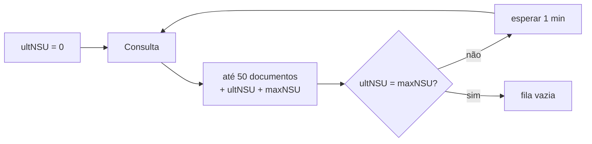

# Distribuição de DF-e

A distribuição de DF-e é o serviço pelo qual a Receita entrega os documentos
fiscais **de interesse** de um CNPJ — inclusive os que terceiros emitiram contra
ele. É a única forma legítima de descobrir que um fornecedor emitiu uma nota em
seu nome.

## A fila

O serviço funciona como uma fila numerada. Cada documento recebe um **NSU**, e o
cliente pede tudo o que veio depois do último NSU que já consumiu.



Cada consulta devolve no máximo cinquenta documentos, o maior NSU devolvido
(`ultNSU`) e o maior NSU existente na base (`maxNSU`). Quando os dois se
igualam, a fila acabou.

!!! danger "Consumo indevido bloqueia por uma hora"

    A Receita bloqueia quem consulta com frequência excessiva — código 656. O
    bloqueio costuma durar uma hora e vale para o CNPJ inteiro, não só para o
    processo que errou.

    As regras práticas: **um minuto** entre consultas enquanto ainda há fila, e
    **uma hora** entre execuções depois de esvaziá-la. `ConsumirDFe` respeita o
    primeiro intervalo sozinho; o segundo é responsabilidade do seu agendador.

## Consumindo a fila

```go
cliente, _ := sefaz.NovoCliente(sefaz.Config{
    UF: uf.RS, Ambiente: nfe.Producao,
    Modelo: nfe.ModeloNFe, Certificado: cert,
})

ultimoNSU := carregarDoBanco() // "0" na primeira execução

nsu, err := cliente.ConsumirDFe(ctx, ultimoNSU, func(d dfe.Documento) error {
    log.Println(d.Descrever())
    return gravar(d)
})
gravarNoBanco(nsu) // mesmo em caso de erro
```

`ConsumirDFe` percorre a fila até o fim, chamando a função uma vez por
documento. Se a função devolver erro, o consumo para e o NSU devolvido é o do
**último documento processado com sucesso** — de modo que a próxima execução
retome exatamente de onde parou, sem pular nada.

Grave o NSU sempre, inclusive no caminho de erro. Perder o NSU significa
reconsumir a fila inteira, o que é lento e arrisca o bloqueio por consumo
indevido.

## O que chega na fila

Quatro tipos de documento, distinguidos pelo campo `schema`:

| Método | Schema | Conteúdo |
| --- | --- | --- |
| `EhResumoNFe()` | `resNFe` | Resumo de uma nota emitida contra você |
| `EhNFeCompleta()` | `procNFe` | A nota inteira, com protocolo |
| `EhResumoEvento()` | `resEvento` | Resumo de um evento em nota de seu interesse |
| `EhEventoCompleto()` | `procEventoNFe` | O evento com o respectivo retorno |

```go
switch {
case d.EhResumoNFe():
    r, _ := d.ResumoNFe()
    fmt.Println(r.XNome, r.VNF, r.Autorizada())

case d.EhNFeCompleta():
    n, prot, _ := d.NFe()
    fmt.Println(n.Chave(), prot.Resumo())

case d.EhResumoEvento():
    r, _ := d.ResumoEvento()
    fmt.Println(string(r.TpEvento), r.XEvento)

case d.EhEventoCompleto():
    e, ret, _ := d.Evento()
    fmt.Println(e.Tipo().Rotulo(), ret.Resumo())
}
```

!!! info "Resumo primeiro, nota depois"

    A nota completa **não** chega de imediato. Enquanto o destinatário não
    manifestar ciência ou confirmação da operação, a Receita entrega apenas o
    resumo: chave, emitente, valor e situação.

    Depois da manifestação, a NF-e inteira aparece na fila com um NSU novo. O
    fluxo típico é: receber o resumo → registrar
    [ciência da operação](eventos.md#manifestacao-do-destinatario) → receber a
    nota completa na volta seguinte.

## Consultas pontuais

Além do consumo sequencial, dá para pedir um documento específico:

```go
// Por NSU, para recuperar um documento que se perdeu.
r, err := cliente.DistribuicaoDFe(ctx, dfe.Consulta{NSU: "000000000000042"})

// Por chave, desde que já tenha havido manifestação de interesse.
r, err := cliente.DistribuicaoDFe(ctx, dfe.Consulta{Chave: chave})
```

## Quem consulta

Por padrão, o CNPJ do titular do certificado. Um escritório contábil que assina
com o próprio certificado em nome de um cliente informa o CNPJ do cliente:

```go
cliente, _ := sefaz.NovoCliente(sefaz.Config{
    // …
    CNPJConsulente: "99999999000191",
})
```

## Rotina sugerida

```go
func sincronizar(ctx context.Context) error {
    nsu, err := repo.UltimoNSU(ctx)
    if err != nil {
        return err
    }

    novo, erroConsumo := cliente.ConsumirDFe(ctx, nsu, func(d dfe.Documento) error {
        return repo.Gravar(ctx, d)
    })

    // O NSU avança mesmo quando o consumo é interrompido.
    if err := repo.SalvarNSU(ctx, novo); err != nil {
        return err
    }
    if errors.Is(erroConsumo, dfe.ErrConsumoIndevido) {
        log.Println("bloqueado por consumo indevido; próxima tentativa em uma hora")
        return nil
    }
    return erroConsumo
}
```

Agende essa rotina de hora em hora. Rodá-la com mais frequência não traz
documentos mais cedo — a fila é atualizada em lotes pela própria Receita — e
aproxima o bloqueio.
