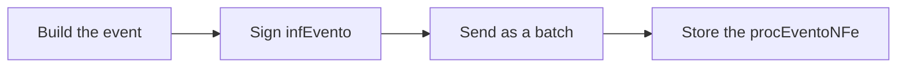

# Events

An event is a document in its own right, with structure and signature
independent from the invoice it refers to. Once registered, it is stored
alongside its response in a `procEventoNFe` — the analogue of `nfeProc` for
events.

The [`evento`](https://pkg.go.dev/github.com/mschunke/gonfe/evento) package
covers:

| Event | Code | Who registers it |
| --- | --- | --- |
| Letter of correction | 110110 | Issuer |
| Cancellation | 110111 | Issuer |
| Cancellation by replacement | 110112 | NFC-e issuer |
| Operation confirmed | 210200 | Recipient |
| Operation acknowledged | 210210 | Recipient |
| Operation not recognised | 210220 | Recipient |
| Operation not carried out | 210240 | Recipient |

**Voiding of number ranges** also lives in this package. It is not an event in
the layout — it is a separate document, sent to a different service — but it
shares the signing pattern and the path to SEFAZ.

## The flow, in three steps

Every event follows the same path:



```go
e, err := evento.NovoCancelamento(evento.DadosCancelamento{ /* … */ })
assinado, err := e.AssinarCom(cert)
ret, err := cliente.EnviarEvento(ctx, assinado)
proc, err := evento.MontarProcEvento(assinado, ret)
```

!!! warning "A refused batch and a refused event are different things"

    `EnviarEvento` returns an error when SEFAZ refuses the **batch**. When the
    batch is accepted but the **event** is refused — a cancellation past its
    deadline, say — there is no error: the reason is in the response's status
    code. Always check:

    ```go
    if !ret.Registrado() {
        return fmt.Errorf("evento recusado: %s", ret.Resumo())
    }
    ```

## Cancellation

Cancelling requires the authorisation protocol number — the same one SEFAZ
returned when the invoice was authorised. If you did not keep it, recover it
with `cliente.ConsultarNFe(ctx, chave)`.

```go
e, err := evento.NovoCancelamento(evento.DadosCancelamento{
    Chave:         chave,
    CNPJ:          "12345678000195",
    UF:            uf.RS,
    Ambiente:      nfe.Homologacao,
    Protocolo:     prot.InfProt.NProt,
    Justificativa: "Cancelamento por erro de digitacao no pedido do cliente",
})
```

The justification must be between 15 and 255 characters — the library refuses it
before spending a round trip to SEFAZ.

!!! note "The deadline"

    As a rule 24 hours from authorisation, with variations by state. Past that,
    SEFAZ answers with code 501 and the invoice can only be undone through a
    voluntary disclosure, outside the system.

    **Denied** invoices (code 110) cannot be cancelled: they are born without
    effect.

### Cancellation by replacement

Some states allow cancelling an NFC-e by pointing at the one that replaced it:

```go
e, err := evento.NovoCancelamentoPorSubstituicao(evento.DadosCancelamentoPorSubstituicao{
    Chave:           chaveOriginal,
    CNPJ:            cnpj,
    UF:              uf.RS,
    Ambiente:        nfe.Producao,
    Protocolo:       protocoloOriginal,
    Justificativa:   "Cancelamento por substituicao apos correcao do pedido",
    ChaveSubstituta: chaveNova,
})
```

## Letter of correction

Corrects information that does **not** change the tax value, the identification
of the parties, or the issue and departure dates. That restriction is the legal
clause that goes in the `xCondUso` field, filled in automatically from
`evento.TextoCondicaoDeUso`.

```go
e, err := evento.NovaCartaCorrecao(evento.DadosCartaCorrecao{
    Chave:     chave,
    CNPJ:      cnpj,
    UF:        uf.RS,
    Ambiente:  nfe.Producao,
    Sequencia: 1,
    Correcao:  "Fica corrigido o endereco de entrega para Rua Nova, 100, Centro",
})
```

!!! danger "Each letter replaces the previous one"

    The last letter registered is the one that counts — it is not a list of
    corrections that accumulates. If you issued letter 1 correcting the address
    and then need to correct the carrier, letter 2 must **repeat the address
    correction** and add the new one. Otherwise the earlier correction ceases to
    apply.

The text runs from 15 to 1000 characters, and up to 20 letters are allowed per
invoice, with an always-increasing sequence number.

## Recipient acknowledgement

The four acknowledgements are registered by whoever **receives** the invoice,
not by whoever issues it. They go to the National Environment rather than the
state SEFAZ — the client handles that detour on its own.

```go
e, err := evento.NovaManifestacao(evento.DadosManifestacao{
    Chave:    chave,
    CNPJ:     cnpjDoDestinatario,
    Ambiente: nfe.Producao,
    Tipo:     evento.TipoConfirmacaoOperacao,
})
```

| Type | When to use it |
| --- | --- |
| `TipoCienciaOperacao` | You know the invoice exists, but are not committing yet |
| `TipoConfirmacaoOperacao` | The operation happened as described |
| `TipoDesconhecimentoOperacao` | You do not recognise the operation |
| `TipoOperacaoNaoRealizada` | The operation was yours, but it did not go through |

Only "operation not carried out" accepts — and requires — a justification:

```go
e, err := evento.NovaManifestacao(evento.DadosManifestacao{
    Chave:         chave,
    CNPJ:          cnpj,
    Ambiente:      nfe.Producao,
    Tipo:          evento.TipoOperacaoNaoRealizada,
    Justificativa: "Mercadoria nao foi entregue pelo transportador no prazo",
})
```

Note that `DadosManifestacao` has no `UF` field: the destination is always the
National Environment.

## Voiding number ranges

Voiding declares to the tax authority that a range of numbers was not and will
not be used — usually because a failure in the issuing system consumed numbers
without producing documents. It does **not** undo invoices; cancellation exists
for that.

```go
i, err := evento.NovaInutilizacao(evento.DadosInutilizacao{
    UF:            uf.RS,
    Ambiente:      nfe.Producao,
    CNPJ:          "12345678000195",
    Ano:           26,          // two digits
    Modelo:        nfe.ModeloNFe,
    Serie:         1,
    NumeroInicial: 145,
    NumeroFinal:   150,
    Justificativa: "Falha no sistema emissor durante a geracao dos numeros",
})

assinada, err := i.AssinarCom(cert)   // signs the infInut group
ret, err := cliente.Inutilizar(ctx, assinada)
if ret.Homologada() {
    proc, _ := evento.MontarProcInut(assinada, ret)
}
```

The range must be contiguous and belong entirely to the same series and year. If
any number in the range has an authorised document, SEFAZ refuses the whole
request — there is no partial voiding. That is why, unlike events, `Inutilizar`
returns an error when the status is not 102.

## Sending as a batch

A batch holds up to twenty events, and all of them must share the same
destination:

```go
lote := [][]byte{carta1, carta2, carta3}
resposta, err := cliente.EnviarLoteDeEventos(ctx, "42", lote...)
for _, ret := range resposta.RetEvento {
    fmt.Println(ret.Resumo())
}
```

Mixing an acknowledgement with a cancellation would make SEFAZ refuse the entire
batch, because the two go to different servers. The library detects that before
transmitting and explains the conflict.

## Storing the result

The `procEventoNFe` is the event's receipt. It joins the signed event with the
response, preserving byte for byte the data that was signed:

```go
proc, err := evento.MontarProcEvento(assinado, ret)
os.WriteFile(chave+"-"+string(e.Tipo())+"-procEvento.xml", nfe.XMLDeclarado(proc), 0o644)
```

For a cancellation, that file must be kept for the same period as the invoice
and handed to whoever received the original `nfeProc`.

To read it back:

```go
e, ret, err := evento.LerProcEvento(dados)
```

## Listing the events on an invoice

A lookup by key returns every event already registered:

```go
consulta, err := cliente.ConsultarNFe(ctx, chave)
for _, p := range consulta.ProcEventoNFe {
    i := p.RetEvento.InfEvento
    fmt.Printf("%s %s em %s\n", string(i.TpEvento), i.XEvento, i.DhRegEvento)
}
```

## Return codes

| Code | Meaning |
| --- | --- |
| 128 | Event batch processed — read each event's response |
| 135 | Event registered and linked to the invoice |
| 136 | Event registered, but not yet linked — the invoice was not in the database |
| 101 | Cancellation approved |
| 102 | Voiding approved |
| 501 | Cancellation past the deadline |
| 573 | Duplicate event — that sequence number was already used |

`Registrado()` covers 101, 135 and 136; `Vinculado()` covers 101 and 135. Code
136 is a success: the event holds, and the link happens once the invoice
arrives.

## Runnable example

[`exemplos/eventos`](https://github.com/mschunke/gonfe/blob/main/exemplos/eventos/main.go)
registers cancellations, letters of correction, acknowledgements and voidings
from the command line:

```bash
export GONFE_CERT=./certificado.pfx
export GONFE_SENHA=...

go run ./exemplos/eventos cancelar   -chave 4326... -protocolo 1432... -just "Erro de digitacao no pedido"
go run ./exemplos/eventos corrigir   -chave 4326... -texto "Fica corrigido o endereco de entrega"
go run ./exemplos/eventos manifestar -chave 4326... -tipo ciencia
go run ./exemplos/eventos inutilizar -serie 900 -de 10 -ate 12 -just "Falha no sistema emissor"
```
