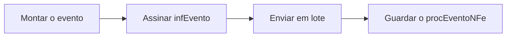

# Eventos

Um evento é um documento próprio, com estrutura e assinatura independentes da
nota a que se refere. Depois de registrado, ele é guardado junto com o retorno
em um `procEventoNFe` — o análogo do `nfeProc` para eventos.

O pacote [`evento`](https://pkg.go.dev/github.com/mschunke/gonfe/evento) cobre:

| Evento | Código | Quem registra |
| --- | --- | --- |
| Carta de correção | 110110 | Emitente |
| Cancelamento | 110111 | Emitente |
| Cancelamento por substituição | 110112 | Emitente da NFC-e |
| Confirmação da operação | 210200 | Destinatário |
| Ciência da operação | 210210 | Destinatário |
| Desconhecimento da operação | 210220 | Destinatário |
| Operação não realizada | 210240 | Destinatário |

A **inutilização de numeração** também mora neste pacote. Ela não é um evento
no leiaute — é um documento à parte, enviado a outro serviço —, mas compartilha
o padrão de assinatura e o caminho até a SEFAZ.

## O fluxo, em três passos

Todos os eventos seguem o mesmo caminho:



```go
e, err := evento.NovoCancelamento(evento.DadosCancelamento{ /* … */ })
assinado, err := e.AssinarCom(cert)
ret, err := cliente.EnviarEvento(ctx, assinado)
proc, err := evento.MontarProcEvento(assinado, ret)
```

!!! warning "Lote recusado e evento recusado são coisas diferentes"

    `EnviarEvento` devolve erro quando a SEFAZ recusa o **lote**. Quando o lote
    é aceito mas o **evento** é recusado — cancelamento fora de prazo, por
    exemplo —, não há erro: o motivo está no código de status do retorno.
    Sempre confira:

    ```go
    if !ret.Registrado() {
        return fmt.Errorf("evento recusado: %s", ret.Resumo())
    }
    ```

## Cancelamento

Cancelar exige o número do protocolo de autorização — o mesmo que veio na
resposta da SEFAZ quando a nota foi autorizada. Se você não o guardou,
recupere-o com `cliente.ConsultarNFe(ctx, chave)`.

```go
e, err := evento.NovoCancelamento(evento.DadosCancelamento{
    Chave:         chave,
    CNPJ:          "12345678000195",
    UF:            uf.RS,
    Ambiente:      nfe.Homologacao,
    Protocolo:     prot.InfProt.NProt,
    Justificativa: "Cancelamento por erro de digitacao no pedido do cliente",
})
```

A justificativa tem de ter entre 15 e 255 caracteres — a biblioteca recusa
antes de gastar uma ida à SEFAZ.

!!! note "O prazo"

    Em regra 24 horas a partir da autorização, com variações por unidade da
    federação. Passado o prazo, a SEFAZ responde com o código 501 e a nota só
    sai por denúncia espontânea, fora do sistema.

    Notas **denegadas** (código 110) não podem ser canceladas: elas já nascem
    sem efeito.

### Cancelamento por substituição

Algumas UFs permitem cancelar uma NFC-e apontando a que a substituiu:

```go
e, err := evento.NovoCancelamentoPorSubstituicao(evento.DadosCancelamentoPorSubstituicao{
    Chave:           chaveOriginal,
    CNPJ:            cnpj,
    UF:              uf.RS,
    Ambiente:        nfe.Producao,
    Protocolo:       protocoloOriginal,
    Justificativa:   "Cancelamento por substituicao apos correcao do pedido",
    ChaveSubstituta: chaveNova,
})
```

## Carta de correção

Corrige informação que **não** altere o valor do imposto, a identificação das
partes nem as datas de emissão e de saída. Essa restrição é a cláusula legal
que vai no campo `xCondUso`, preenchida automaticamente com
`evento.TextoCondicaoDeUso`.

```go
e, err := evento.NovaCartaCorrecao(evento.DadosCartaCorrecao{
    Chave:     chave,
    CNPJ:      cnpj,
    UF:        uf.RS,
    Ambiente:  nfe.Producao,
    Sequencia: 1,
    Correcao:  "Fica corrigido o endereco de entrega para Rua Nova, 100, Centro",
})
```

!!! danger "Cada carta substitui a anterior"

    A última carta registrada é a que vale — não é uma lista de correções que se
    acumula. Se você emitiu a carta 1 corrigindo o endereço e depois precisa
    corrigir o transportador, a carta 2 tem de **repetir a correção do endereço**
    e acrescentar a nova. Do contrário, a correção anterior deixa de valer.

O texto vai de 15 a 1000 caracteres, e são permitidas até 20 cartas por nota,
com a sequência sempre crescente.

## Manifestação do destinatário

As quatro manifestações são registradas por quem **recebe** a nota, não por
quem a emite. Elas vão para o Ambiente Nacional, e não para a SEFAZ do estado —
o cliente cuida desse desvio sozinho.

```go
e, err := evento.NovaManifestacao(evento.DadosManifestacao{
    Chave:    chave,
    CNPJ:     cnpjDoDestinatario,
    Ambiente: nfe.Producao,
    Tipo:     evento.TipoConfirmacaoOperacao,
})
```

| Tipo | Quando usar |
| --- | --- |
| `TipoCienciaOperacao` | Você sabe que a nota existe, mas ainda não se pronuncia |
| `TipoConfirmacaoOperacao` | A operação ocorreu como descrita |
| `TipoDesconhecimentoOperacao` | Você não reconhece a operação |
| `TipoOperacaoNaoRealizada` | A operação era sua, mas não se concretizou |

Só a operação não realizada aceita — e exige — justificativa:

```go
e, err := evento.NovaManifestacao(evento.DadosManifestacao{
    Chave:         chave,
    CNPJ:          cnpj,
    Ambiente:      nfe.Producao,
    Tipo:          evento.TipoOperacaoNaoRealizada,
    Justificativa: "Mercadoria nao foi entregue pelo transportador no prazo",
})
```

Repare que `DadosManifestacao` não tem campo `UF`: o destino é sempre o Ambiente
Nacional.

## Inutilização de numeração

A inutilização declara ao fisco que uma faixa de números não foi e não será
usada — em geral porque uma falha no sistema emissor consumiu números sem gerar
documento. Ela **não desfaz notas**; para isso existe o cancelamento.

```go
i, err := evento.NovaInutilizacao(evento.DadosInutilizacao{
    UF:            uf.RS,
    Ambiente:      nfe.Producao,
    CNPJ:          "12345678000195",
    Ano:           26,          // dois dígitos
    Modelo:        nfe.ModeloNFe,
    Serie:         1,
    NumeroInicial: 145,
    NumeroFinal:   150,
    Justificativa: "Falha no sistema emissor durante a geracao dos numeros",
})

assinada, err := i.AssinarCom(cert)   // assina o grupo infInut
ret, err := cliente.Inutilizar(ctx, assinada)
if ret.Homologada() {
    proc, _ := evento.MontarProcInut(assinada, ret)
}
```

A faixa precisa ser contígua e pertencer inteiramente à mesma série e ao mesmo
ano. Se qualquer número da faixa tiver documento autorizado, a SEFAZ recusa o
pedido inteiro — não há inutilização parcial. Por isso, diferente dos eventos,
`Inutilizar` devolve erro quando o status não é 102.

## Enviando em lote

Um lote comporta até vinte eventos, e todos precisam ter o mesmo destino:

```go
lote := [][]byte{carta1, carta2, carta3}
resposta, err := cliente.EnviarLoteDeEventos(ctx, "42", lote...)
for _, ret := range resposta.RetEvento {
    fmt.Println(ret.Resumo())
}
```

Misturar uma manifestação com um cancelamento faria a SEFAZ recusar o lote
inteiro, porque os dois vão para servidores diferentes. A biblioteca detecta
isso antes de transmitir e explica o conflito.

## Guardando o resultado

O `procEventoNFe` é o comprovante do evento. Ele junta o evento assinado com o
retorno, preservando byte a byte os dados que foram assinados:

```go
proc, err := evento.MontarProcEvento(assinado, ret)
os.WriteFile(chave+"-"+string(e.Tipo())+"-procEvento.xml", nfe.XMLDeclarado(proc), 0o644)
```

No cancelamento, esse arquivo precisa ser guardado pelo mesmo prazo da nota e
entregue a quem recebeu o `nfeProc` original.

Para ler de volta:

```go
e, ret, err := evento.LerProcEvento(dados)
```

## Consultando os eventos de uma nota

A consulta pela chave devolve todos os eventos já registrados:

```go
consulta, err := cliente.ConsultarNFe(ctx, chave)
for _, p := range consulta.ProcEventoNFe {
    i := p.RetEvento.InfEvento
    fmt.Printf("%s %s em %s\n", string(i.TpEvento), i.XEvento, i.DhRegEvento)
}
```

## Códigos de retorno

| Código | Significado |
| --- | --- |
| 128 | Lote de evento processado — leia o retorno de cada evento |
| 135 | Evento registrado e vinculado à nota |
| 136 | Evento registrado, mas ainda não vinculado — a nota não estava no banco |
| 101 | Cancelamento homologado |
| 102 | Inutilização homologada |
| 501 | Cancelamento fora de prazo |
| 573 | Duplicidade de evento — a sequência já foi usada |

`Registrado()` cobre 101, 135 e 136; `Vinculado()` cobre 101 e 135. O código 136
é sucesso: o evento vale, e o vínculo acontece quando a nota chegar.

## Exemplo executável

[`exemplos/eventos`](https://github.com/mschunke/gonfe/blob/main/exemplos/eventos/main.go)
registra cancelamento, carta de correção, manifestação e inutilização a partir
da linha de comando:

```bash
export GONFE_CERT=./certificado.pfx
export GONFE_SENHA=...

go run ./exemplos/eventos cancelar   -chave 4326... -protocolo 1432... -just "Erro de digitacao no pedido"
go run ./exemplos/eventos corrigir   -chave 4326... -texto "Fica corrigido o endereco de entrega"
go run ./exemplos/eventos manifestar -chave 4326... -tipo ciencia
go run ./exemplos/eventos inutilizar -serie 900 -de 10 -ate 12 -just "Falha no sistema emissor"
```
