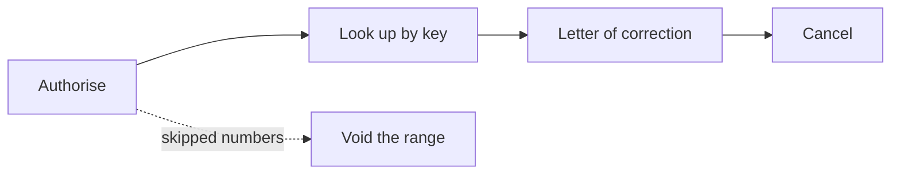

# Testing against homologation

Every SEFAZ maintains a homologation environment: same services, same validation
rules, same rejection codes — but documents authorised there have no fiscal
value and are discarded periodically. It is where you get to make mistakes
freely.

This guide is a script: what to prepare, in what order to test, and how to read
what comes back.

## What you need before you start

**A real A1 certificate.** There is no ICP-Brasil test certificate: the
homologation environment requires the same certificate you would use in
production, because the mutual TLS authentication is real. If you do not have
one yet, that is the first step.

**An active state registration.** The CNPJ must be in good standing with the
state; otherwise SEFAZ answers with "use denied" (301) even in homologation.

**A homologation CSC**, if you are going to test the NFC-e. It is a different
code from the production one, issued on the state SEFAZ portal. Using the
production one in homologation produces a QR Code that does not check out.

!!! warning "Homologation numbering is real numbering"

    SEFAZ enforces duplicate detection by access key in homologation too. Use a
    **dedicated series** for tests — series 900 or 999, for instance — and a
    counter separate from production. Reusing a number gives rejection 204
    (duplicate), and is a silly way to lose an afternoon.

## Step 1 — Prove the connection

Before building any invoice, confirm that the certificate, the endpoint and TLS
are all standing:

```bash
export GONFE_SENHA=...
go run ./exemplos/status-servico -cert ./certificado.pfx -uf RS
```

```text
certificado: COMERCIO EXEMPLO LTDA (CNPJ 12345678000195), emitido por AC ...
autorizador: SVRS
endereço:    https://nfe-homologacao.sefazrs.rs.gov.br/ws/NfeStatusServico/NfeStatusServico4.asmx
resposta:    107 Servico em Operacao
tudo certo: o ambiente está em operação
```

If that command fails, nothing else will work. See the symptom table in
[Installation](instalacao.md#if-something-goes-wrong).

## Step 2 — Adjust the invoice for homologation

The homologation environment imposes two content rules, one per model.
`AjustarParaHomologacao` applies whichever fits:

```go
n.InfNFe.Ide.TpAmb = nfe.Homologacao
nfe.AjustarParaHomologacao(n)
```

| Model | Rule |
| --- | --- |
| 55 (NF-e) | The recipient's name must be exactly `NF-E EMITIDA EM AMBIENTE DE HOMOLOGACAO - SEM VALOR FISCAL` |
| 65 (NFC-e) | The first item's description must be exactly `NOTA FISCAL EMITIDA EM AMBIENTE DE HOMOLOGACAO - SEM VALOR FISCAL` |

The model 55 rule is checked by `Validar`. The model 65 one is not enforced,
because the requirement varies between states; if yours applies it,
`AjustarParaHomologacao` already sets the field correctly.

## Step 3 — Issue the first invoice

Start with the simplest case your operation allows: **one item**, **full
taxation**, **cash payment**, **no freight**. Every field you leave out is one
fewer rejection reason to investigate.

```bash
go run ./exemplos/emitir-nfe -numero 1 -serie 900
```

The example runs the full cycle and writes two files: the signed invoice and the
`procNFe` with its protocol.

Prefer **synchronous submission** in the first tests — the result comes back in
the same response, without the receipt-polling step:

```go
lote, _ := nfe.MontarLote("1", true, assinada) // true = synchronous
envio, err := cliente.Autorizar(ctx, lote)
if envio.ProtNFe != nil {
    fmt.Println(envio.ProtNFe.Resumo())
}
```

## Step 4 — Walk the whole lifecycle

With authorisation working, test the rest in the order real life happens:



```go
// Lookup: confirms the invoice exists in the SEFAZ database.
consulta, _ := cliente.ConsultarNFe(ctx, chave)

// Letter of correction: up to 20 per invoice, increasing sequence.
cc := evento.NovaCartaCorrecao(evento.DadosCartaCorrecao{
    Chave: chave, CNPJ: cnpj, UF: uf.RS, Ambiente: nfe.Homologacao,
    Sequencia: 1,
    Correcao:  "Fica corrigido o endereco de entrega para Rua Nova, 100",
})

// Cancellation: requires the authorisation protocol number.
canc := evento.NovoCancelamento(evento.DadosCancelamento{
    Chave: chave, CNPJ: cnpj, UF: uf.RS, Ambiente: nfe.Homologacao,
    Protocolo:     prot.InfProt.NProt,
    Justificativa: "Cancelamento por erro de digitacao no pedido do cliente",
})

// Voiding: for the range of numbers that was lost.
inut := evento.NovaInutilizacao(evento.DadosInutilizacao{
    UF: uf.RS, Ambiente: nfe.Homologacao, CNPJ: cnpj, Ano: 26,
    Modelo: nfe.ModeloNFe, Serie: 900, NumeroInicial: 10, NumeroFinal: 12,
    Justificativa: "Falha no sistema emissor durante a geracao dos numeros",
})
```

Details of each in [Events](eventos.md).

!!! note "Cancellation has a deadline"

    Generally 24 hours from authorisation — some states allow more. Past the
    deadline, SEFAZ answers 501 and the invoice can only be undone through a
    voluntary disclosure. In homologation it is worth testing both paths:
    cancelling straight away and cancelling after the deadline, to see how your
    system reacts to each answer.

## Step 5 — NFC-e

The receipt has one extra step, and the order matters:

```go
n.Preparar()                                          // builds the key
nfce.PreencherSuplemento(n, nfce.Opcoes{CSC: csc})    // QR Code, before signing
n.Validar()
assinada, _ := xmldsig.Assinar(documento, "infNFe", cert)
```

After authorising, **open the QR Code in a browser**. That is the only test that
proves the CSC and the URL are right end to end — the invoice is authorised even
with a wrong QR Code, and the error only surfaces when a consumer tries to look
it up.

```go
fmt.Println(n.InfNFeSupl.QrCode)
```

To check without leaving the code:

```go
err := nfce.ConferirQRCode(n.InfNFeSupl.QrCode, csc.Codigo)
```

## Reading the responses

The codes that matter day to day:

| Code | Meaning | What to do |
| --- | --- | --- |
| 100 | NF-e authorised | Store the `procNFe` |
| 101 | Cancellation approved | Store the `procEventoNFe` |
| 102 | Voiding approved | Store the protocol |
| 103 | Batch received | Query the receipt |
| 104 | Batch processed | Read each invoice's protocol |
| 105 | Batch processing | Query again in a few seconds |
| 107 | Service in operation | Carry on |
| 108 / 109 | Service halted | Wait, or issue under contingency |
| 110 / 301 / 302 | Use denied | Tax irregularity; the invoice is recorded and cannot be cancelled |
| 128 | Event batch processed | Read the `retEvento` inside |
| 135 | Event registered and linked | Success |
| 136 | Event registered, not linked | Partial success: the invoice has not reached the SEFAZ database yet |
| 204 | Duplicate NF-e | The number was already used; advance the counter |
| 215 / 225 | XML schema failure | The XML structure is outside the layout |
| 226 | Issuer's state differs from the authoriser | Wrong `cUF`, or the client points at the wrong state |
| 236 | Access key with invalid check digit | A key was built by hand somewhere |
| 280 / 281 | Transmitter certificate invalid or expired | A TLS problem, not a signing one |
| 290 / 297 / 298 | Invalid or non-standard signature | See below |
| 501 | Cancellation past the deadline | More than 24 hours went by |
| 573 | Duplicate event | The same `nSeqEvento` was already used |
| 656 | Excessive polling | You queried too fast; see below |

The complete list is in the Manual de Orientação do Contribuinte, in the codes
and messages annex.

### Signature rejections (290, 297, 298)

If this happens while using this library, the near-certain cause is the XML
having been altered **after** signing. Check before transmitting:

```go
if err := xmldsig.Verificar(assinada); err != nil {
    log.Fatal(err) // the problem is before the transmission
}
```

If `Verificar` passes and SEFAZ still rejects, then it is worth opening an issue
with the XML (without real customer data).

### Excessive polling (656)

SEFAZ blocks clients that query too quickly — and the block can last an hour.
The practical rules:

- Never query the same receipt at an interval shorter than the `tMed` SEFAZ
  itself returned. `EsperarProcessamento` honours the interval you pass; three
  seconds is a safe value.
- Do not repeat a lookup for a key that already answered "does not exist" —
  treat that as a final answer, not a transient error.
- In development, watch out for retry loops in automated tests.

```go
resultado, err := cliente.EsperarProcessamento(ctx, recibo, 3*time.Second, 20)
```

## Organising the tests

**Separate series and counter.** Series 900+ for homologation, the counter in a
different table. Never share a sequence with production.

**Keep the XML files.** All of them, including the rejected ones. When a
rejection reappears months later, the old XML is what turns hours into minutes.

**Test the unhappy path.** Service down, a timeout mid-submission, a response
arriving after the process has died. The most dangerous case is a submitted
batch whose receipt you lost: the invoice may well have been authorised. The way
out is `ConsultarNFe` by key — which you computed before sending, and therefore
should have stored before sending.

```go
// Store the key BEFORE transmitting; it is what lets you recover the state.
n.Preparar()
gravarNoBanco(n.Chave(), "enviando")
```

**Do not mix environments in the same configuration.** A `tpAmb` left wrong in
production issues an invoice with no fiscal value while believing it issued a
valid one — and the customer only finds out at month-end close.

## Moving to production

Once the script above is all green:

1. Swap `nfe.Homologacao` for `nfe.Producao` — in a single place in your code,
   preferably coming from configuration.
2. Check the production endpoints with `exemplos/status-servico -producao`.
3. Swap the homologation CSC for the production one, if you use NFC-e.
4. Put the recipient's name and the product descriptions back to normal —
   `AjustarParaHomologacao` should only run when `tpAmb` is 2.
5. Start with real numbering at series 1, number 1, and issue **one** invoice.
   Check the `procNFe` and the DANFE before releasing the whole flow.
