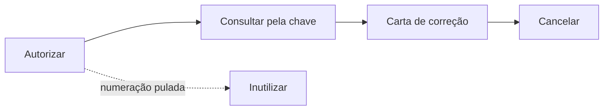

# Testes em homologação

Toda SEFAZ mantém um ambiente de homologação: mesmos serviços, mesmas regras de
validação, mesmos códigos de rejeição — mas os documentos autorizados ali não
têm valor fiscal e são descartados periodicamente. É onde se erra à vontade.

Este guia é um roteiro: o que preparar, em que ordem testar e como ler o que
volta.

## O que você precisa antes de começar

**Um certificado A1 de verdade.** Não existe certificado de teste da ICP-Brasil:
o ambiente de homologação exige o mesmo certificado que você usaria em produção,
porque a autenticação mútua TLS é real. Se ainda não tem um, é o primeiro passo.

**Inscrição estadual habilitada.** O CNPJ precisa estar com situação regular na
UF; caso contrário a SEFAZ responde com uso denegado (301) mesmo em homologação.

**CSC de homologação**, se for testar NFC-e. É um código diferente do de
produção, emitido no portal da SEFAZ estadual. Usar o de produção em homologação
gera um QR Code que não confere.

!!! warning "Numeração de homologação é numeração de verdade"

    A SEFAZ controla duplicidade por chave de acesso também em homologação. Use
    uma **série exclusiva** para testes — série 900 ou 999, por exemplo — e um
    contador separado do de produção. Reaproveitar número dá rejeição 204
    (duplicidade), e é um jeito bobo de perder uma tarde.

## Passo 1 — Provar a conexão

Antes de montar qualquer nota, confirme que o certificado, o endereço e o TLS
estão de pé:

```bash
export GONFE_SENHA=...
go run ./exemplos/status-servico -cert ./certificado.pfx -uf RS
```

```text
certificado: COMERCIO EXEMPLO LTDA (CNPJ 12345678000195), emitido por AC ...
autorizador: SVRS
endereço:    https://nfe-homologacao.sefazrs.rs.gov.br/ws/NfeStatusServico/NfeStatusServico4.asmx
resposta:    107 Servico em Operacao
tudo certo: o ambiente está em operação
```

Se esse comando falha, nada mais vai funcionar. Consulte a tabela de sintomas em
[Instalação](instalacao.md#se-algo-der-errado).

## Passo 2 — Ajustar a nota para homologação

O ambiente de homologação impõe duas regras de conteúdo, cada uma para um
modelo. `AjustarParaHomologacao` aplica a que couber:

```go
n.InfNFe.Ide.TpAmb = nfe.Homologacao
nfe.AjustarParaHomologacao(n)
```

| Modelo | Regra |
| --- | --- |
| 55 (NF-e) | A razão social do destinatário precisa ser exatamente `NF-E EMITIDA EM AMBIENTE DE HOMOLOGACAO - SEM VALOR FISCAL` |
| 65 (NFC-e) | A descrição do primeiro item precisa ser exatamente `NOTA FISCAL EMITIDA EM AMBIENTE DE HOMOLOGACAO - SEM VALOR FISCAL` |

A regra do modelo 55 é conferida por `Validar`. A do modelo 65 não é imposta,
porque a exigência varia entre as unidades da federação; se a sua SEFAZ a aplica,
`AjustarParaHomologacao` já deixa o campo certo.

## Passo 3 — Emitir a primeira nota

Comece pelo caso mais simples que a sua operação permite: **um item**,
**tributação integral**, **pagamento em dinheiro**, **sem frete**. Cada campo a
menos é um motivo de rejeição a menos para investigar.

```bash
go run ./exemplos/emitir-nfe -numero 1 -serie 900
```

O exemplo faz o ciclo completo e grava dois arquivos: a nota assinada e o
`procNFe` com o protocolo.

Prefira o **envio síncrono** nos primeiros testes — o resultado vem na mesma
resposta, sem a etapa de consultar recibo:

```go
lote, _ := nfe.MontarLote("1", true, assinada) // true = síncrono
envio, err := cliente.Autorizar(ctx, lote)
if envio.ProtNFe != nil {
    fmt.Println(envio.ProtNFe.Resumo())
}
```

## Passo 4 — Percorrer o ciclo de vida

Com a autorização funcionando, teste o resto na ordem em que a vida real
acontece:



```go
// Consulta: confirma que a nota existe no banco da SEFAZ.
consulta, _ := cliente.ConsultarNFe(ctx, chave)

// Carta de correção: até 20 por nota, sequência crescente.
cc := evento.NovaCartaCorrecao(evento.DadosCartaCorrecao{
    Chave: chave, CNPJ: cnpj, UF: uf.RS, Ambiente: nfe.Homologacao,
    Sequencia: 1,
    Correcao:  "Fica corrigido o endereco de entrega para Rua Nova, 100",
})

// Cancelamento: exige o número do protocolo de autorização.
canc := evento.NovoCancelamento(evento.DadosCancelamento{
    Chave: chave, CNPJ: cnpj, UF: uf.RS, Ambiente: nfe.Homologacao,
    Protocolo:     prot.InfProt.NProt,
    Justificativa: "Cancelamento por erro de digitacao no pedido do cliente",
})

// Inutilização: para a faixa de números que se perdeu.
inut := evento.NovaInutilizacao(evento.DadosInutilizacao{
    UF: uf.RS, Ambiente: nfe.Homologacao, CNPJ: cnpj, Ano: 26,
    Modelo: nfe.ModeloNFe, Serie: 900, NumeroInicial: 10, NumeroFinal: 12,
    Justificativa: "Falha no sistema emissor durante a geracao dos numeros",
})
```

Detalhes de cada um em [Eventos](eventos.md).

!!! note "O cancelamento tem prazo"

    Em geral 24 horas a partir da autorização — algumas UFs dão mais. Passado o
    prazo, a SEFAZ responde 501 e a nota só sai por denúncia espontânea. Em
    homologação vale testar os dois caminhos: cancelar logo e cancelar depois do
    prazo, para ver como o seu sistema reage a cada resposta.

## Passo 5 — NFC-e

O cupom tem uma etapa a mais, e a ordem importa:

```go
n.Preparar()                                          // monta a chave
nfce.PreencherSuplemento(n, nfce.Opcoes{CSC: csc})    // QR Code, antes de assinar
n.Validar()
assinada, _ := xmldsig.Assinar(documento, "infNFe", cert)
```

Depois de autorizar, **abra o QR Code no navegador**. É o único teste que prova
que o CSC e a URL estão certos de ponta a ponta — a nota é autorizada mesmo com
QR Code errado, e o erro só aparece quando um consumidor tenta consultar.

```go
fmt.Println(n.InfNFeSupl.QrCode)
```

Para conferir sem sair do código:

```go
err := nfce.ConferirQRCode(n.InfNFeSupl.QrCode, csc.Codigo)
```

## Lendo as respostas

Os códigos que interessam no dia a dia:

| Código | Significado | O que fazer |
| --- | --- | --- |
| 100 | Autorizado o uso da NF-e | Guardar o `procNFe` |
| 101 | Cancelamento homologado | Guardar o `procEventoNFe` |
| 102 | Inutilização homologada | Guardar o protocolo |
| 103 | Lote recebido | Consultar o recibo |
| 104 | Lote processado | Ler o protocolo de cada nota |
| 105 | Lote em processamento | Consultar de novo daqui a alguns segundos |
| 107 | Serviço em operação | Seguir em frente |
| 108 / 109 | Serviço paralisado | Esperar, ou emitir em contingência |
| 110 / 301 / 302 | Uso denegado | Irregularidade fiscal; a nota fica registrada e não pode ser cancelada |
| 128 | Lote de evento processado | Ler o `retEvento` de dentro |
| 135 | Evento registrado e vinculado | Sucesso |
| 136 | Evento registrado, não vinculado | Sucesso parcial: a nota ainda não chegou ao banco da SEFAZ |
| 204 | Duplicidade de NF-e | O número já foi usado; avance o contador |
| 215 / 225 | Falha no schema XML | Estrutura do XML fora do leiaute |
| 226 | UF do emitente diverge da autorizadora | `cUF` errado, ou cliente apontado para a UF errada |
| 236 | Chave com dígito verificador inválido | Chave montada à mão em algum ponto |
| 280 / 281 | Certificado do transmissor inválido ou vencido | Problema no TLS, não na assinatura |
| 290 / 297 / 298 | Assinatura inválida ou fora do padrão | Veja abaixo |
| 501 | Cancelamento fora de prazo | Passou das 24 horas |
| 573 | Duplicidade de evento | O mesmo `nSeqEvento` já foi usado |
| 656 | Consumo indevido | Você consultou rápido demais; veja abaixo |

A lista completa está no Manual de Orientação do Contribuinte, anexo de códigos
e mensagens.

### Rejeição por assinatura (290, 297, 298)

Se acontecer usando esta biblioteca, a causa quase certa é o XML ter sido
alterado **depois** de assinado. Confira antes de transmitir:

```go
if err := xmldsig.Verificar(assinada); err != nil {
    log.Fatal(err) // o problema está antes do envio
}
```

Se `Verificar` passa e a SEFAZ rejeita, aí sim vale abrir uma issue com o XML
(sem dados reais de clientes).

### Consumo indevido (656)

A SEFAZ bloqueia clientes que consultam depressa demais — e o bloqueio pode
durar uma hora. As regras práticas:

- Nunca consulte o mesmo recibo em intervalo menor que o `tMed` devolvido pela
  própria SEFAZ. `EsperarProcessamento` respeita o intervalo que você passar;
  três segundos é um valor seguro.
- Não repita a consulta de uma chave que já respondeu "não existe" — trate isso
  como resposta final, não como erro transitório.
- Em desenvolvimento, cuidado com laços de retentativa em teste automatizado.

```go
resultado, err := cliente.EsperarProcessamento(ctx, recibo, 3*time.Second, 20)
```

## Organizando os testes

**Série e contador separados.** Série 900+ para homologação, contador em outra
tabela. Nunca compartilhe sequência com produção.

**Guarde os XMLs.** Todos, inclusive os rejeitados. Quando uma rejeição
reaparece meses depois, o XML antigo é o que resolve em minutos em vez de horas.

**Teste o caminho triste.** Serviço fora do ar, timeout no meio do envio,
resposta chegando depois de o processo ter caído. O caso mais perigoso é o lote
enviado cujo recibo você perdeu: a nota pode ter sido autorizada. A saída é
`ConsultarNFe` pela chave — que você calculou antes de enviar, e por isso deve
ter gravado antes de enviar.

```go
// Grave a chave ANTES de transmitir; ela é o que permite recuperar o estado.
n.Preparar()
gravarNoBanco(n.Chave(), "enviando")
```

**Não misture ambientes na mesma configuração.** Um `tpAmb` trocado em produção
emite uma nota sem valor fiscal achando que emitiu uma válida — e o cliente só
descobre no fechamento do mês.

## Passando para produção

Quando o roteiro acima estiver todo verde:

1. Troque `nfe.Homologacao` por `nfe.Producao` — em um único lugar do seu
   código, de preferência vindo de configuração.
2. Confira os endereços de produção com `exemplos/status-servico -producao`.
3. Troque o CSC de homologação pelo de produção, se for NFC-e.
4. Volte a razão social do destinatário e a descrição dos produtos ao normal —
   `AjustarParaHomologacao` só deve rodar quando `tpAmb` é 2.
5. Comece com a numeração real na série 1, número 1, e emita **uma** nota.
   Confira o `procNFe` e o DANFE antes de liberar o fluxo inteiro.
