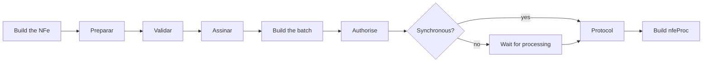

# GoNFE

A Go library for issuing Brazilian electronic fiscal documents, following the
standards published by the Receita Federal and the state tax authorities
(SEFAZ).

```bash
go get github.com/mschunke/gonfe
```

!!! note "About this translation"

    The documentation is available in English, but the **API identifiers stay in
    Portuguese** — `nfe.Nova`, `Preparar`, `Validar`, `chave`, `emitente`. That
    is deliberate: the types mirror the official XSD field by field, with the
    same names, so that checking the code against the Manual de Orientação do
    Contribuinte is a matter of reading the two side by side. Translating the
    identifiers would break that correspondence.

## What already works

<div class="grid cards" markdown>

- :octicons-file-24: **NF-e — model 55**

    Layout 4.00 in full: building the document, computing totals, validation,
    signing, transmission and the distribution file.

    [:octicons-arrow-right-24: Issuing an NF-e](nfe.md)

- :octicons-credit-card-24: **NFC-e — model 65**

    Everything the NF-e has, plus the version 2 QR Code and the lookup URL,
    with the rules specific to the consumer receipt.

    [:octicons-arrow-right-24: Issuing an NFC-e](nfce.md)

- :octicons-shield-check-24: **A1 certificates**

    Modern PKCS#12, no CGO, extracting the CNPJ from the ICP-Brasil OIDs and
    setting up mutual TLS authentication.

    [:octicons-arrow-right-24: Digital certificate](certificado.md)

- :octicons-lock-24: **XML-DSig signing**

    Our own C14N 1.0 canonicalisation, signing in the SEFAZ profile, and
    verification of documents received from third parties.

    [:octicons-arrow-right-24: Digital signature](assinatura.md)

- :octicons-history-24: **Events**

    Cancellation, letter of correction, recipient acknowledgement and voiding
    of number ranges.

    [:octicons-arrow-right-24: Events](eventos.md)

- :octicons-package-24: **Transport documents**

    CT-e (57), CT-e OS (67) and MDF-e (58), with the road modal complete,
    events, and closing out a trip.

    [:octicons-arrow-right-24: CT-e and MDF-e](transporte.md)

- :octicons-file-badge-24: **Auxiliary documents**

    DANFE, NFC-e receipt, DACTE, DACTE OS and DAMDFE as PDFs, written in pure
    Go with no graphics library.

    [:octicons-arrow-right-24: Auxiliary documents](danfe.md)

- :octicons-inbox-24: **DF-e distribution**

    The queue of documents issued against your CNPJ, with the care needed to
    avoid the one-hour block for excessive polling.

    [:octicons-arrow-right-24: DF-e distribution](distribuicao.md)

- :octicons-beaker-24: **Homologation**

    A test script for the SEFAZ sandbox, from first contact to the full
    lifecycle, with the most common rejection codes.

    [:octicons-arrow-right-24: Testing against homologation](homologacao.md)

</div>

Every document the library issues can also be transmitted, corrected, cancelled
and printed. What is still missing is recorded in the
[HANDOFF](https://github.com/mschunke/gonfe/blob/main/HANDOFF.md), with a plan
for each item.

## Why another library

**No `float64` anywhere near a fiscal value.** Every monetary field uses
[`tipos.Decimal`](decimais.md), a fixed-point decimal that honours the scale the
layout demands. Adding one hundred instalments of seven cents gives exactly
seven reais.

**Faithful to the layout.** The structures mirror the XSD field by field, with
the same names and in the same order. Checking them against the Manual de
Orientação do Contribuinte is a matter of reading the two side by side.

**No CGO, and almost no dependencies.** A single external dependency, for
reading modern PKCS#12 files. The same binary runs on Linux, macOS and Windows,
and compiles into a `scratch` container.

**Bytes preserved when signing.** The signature is inserted into the document
without re-serialising it. The digest computed here is exactly the one SEFAZ
recomputes on arrival — the most common cause of "invalid signature" rejections
simply cannot happen.

## The issuing cycle



`Preparar` does three things: it normalises text fields and the scale of every
decimal, computes the totals group from the line items, and builds the access
key with its check digit. `Validar` checks structure, check digits and sums
before you spend a round trip to SEFAZ.

[:octicons-arrow-right-24: Start with your first invoice](primeira-nota.md){ .md-button .md-button--primary }
[:octicons-arrow-right-24: API reference](https://pkg.go.dev/github.com/mschunke/gonfe){ .md-button }

## Before going to production

!!! warning "Three warnings worth more than the rest of this documentation"

    **Check the service endpoints.** The endpoint table reproduces what is
    published on the NF-e portal, but states change addresses without notice.
    Run `exemplos/status-servico` for your state and override whatever differs
    in `sefaz.Config.Endpoints`.

    **Local validation does not replace SEFAZ.** `NFe.Validar` covers structure,
    check digits and sums; SEFAZ applies hundreds of additional business rules.

    **Keep the certificate and the CSC out of your source code.** Both are
    secrets: whoever holds them can issue documents in your name.

## Legal notice

This project is not affiliated with the Receita Federal do Brasil or with any
state tax authority. The layouts, technical notes and service endpoints are
authored by those public bodies and are published on the
[NF-e portal](https://www.nfe.fazenda.gov.br/). Responsibility for the documents
issued lies with whoever issues them.
