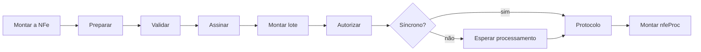

# GoNFE

Biblioteca em Go para emissão de documentos fiscais eletrônicos brasileiros,
seguindo os padrões da Receita Federal e das Secretarias de Fazenda estaduais.

```bash
go get github.com/mschunke/gonfe
```

## O que já funciona

<div class="grid cards" markdown>

- :octicons-file-24: **NF-e — modelo 55**

    Leiaute 4.00 completo: montagem, cálculo de totais, validação, assinatura,
    envio e arquivo de distribuição.

    [:octicons-arrow-right-24: Emissão de NF-e](nfe.md)

- :octicons-credit-card-24: **NFC-e — modelo 65**

    Tudo da NF-e mais o QR Code versão 2 e a URL de consulta, com as regras
    específicas do cupom eletrônico.

    [:octicons-arrow-right-24: Emissão de NFC-e](nfce.md)

- :octicons-shield-check-24: **Certificado A1**

    PKCS#12 moderno, sem CGO, com extração do CNPJ dos OIDs da ICP-Brasil e
    autenticação mútua TLS.

    [:octicons-arrow-right-24: Certificado digital](certificado.md)

- :octicons-lock-24: **Assinatura XML-DSig**

    Canonicalização C14N 1.0 própria, assinatura no perfil da SEFAZ e
    verificação de documentos recebidos.

    [:octicons-arrow-right-24: Assinatura digital](assinatura.md)

- :octicons-history-24: **Eventos**

    Cancelamento, carta de correção, manifestação do destinatário e
    inutilização de faixas de numeração.

    [:octicons-arrow-right-24: Eventos](eventos.md)

- :octicons-beaker-24: **Homologação**

    Roteiro de testes no ambiente da SEFAZ, do primeiro contato ao ciclo
    completo, com os códigos de rejeição mais comuns.

    [:octicons-arrow-right-24: Testes em homologação](homologacao.md)

</div>

CT-e, MDF-e e a distribuição de DF-e estão no roteiro; a infraestrutura comum —
chave de acesso, canonicalização, assinatura e cliente SOAP — já é compartilhada
e não precisará ser reescrita.

## Por que mais uma biblioteca

**Nenhum `float64` em valor fiscal.** Todo campo monetário usa
[`tipos.Decimal`](decimais.md), um decimal de precisão fixa que respeita a
escala exigida pelo leiaute. Somar cem parcelas de sete centavos dá exatamente
sete reais.

**Fiel ao leiaute.** As estruturas espelham o XSD campo a campo, com os mesmos
nomes e na mesma ordem. Conferir contra o Manual de Orientação do Contribuinte é
questão de ler lado a lado.

**Sem CGO e quase sem dependências.** Uma única dependência externa, para ler
arquivos PKCS#12 modernos. O mesmo binário roda em Linux, macOS e Windows, e
compila em container `scratch`.

**Bytes preservados na assinatura.** A assinatura entra no documento sem
reserializá-lo. O resumo criptográfico calculado aqui é exatamente o que a SEFAZ
vai recalcular ao receber — a causa mais comum de rejeição por assinatura
inválida simplesmente não acontece.

## Ciclo de emissão



`Preparar` faz três coisas: normaliza os campos de texto e a escala dos
decimais, calcula o grupo de totais a partir dos itens e monta a chave de
acesso com o dígito verificador. `Validar` confere estrutura, dígitos
verificadores e somatórios antes de gastar uma ida à SEFAZ.

[:octicons-arrow-right-24: Comece pela primeira nota](primeira-nota.md){ .md-button .md-button--primary }
[:octicons-arrow-right-24: Referência da API](https://pkg.go.dev/github.com/mschunke/gonfe){ .md-button }

## Antes de produção

!!! warning "Três avisos que valem mais que o resto da documentação"

    **Confira os endereços dos serviços.** A tabela de endpoints reproduz o que
    está publicado no Portal da NF-e, mas os estados mudam endereços sem aviso.
    Rode `exemplos/status-servico` para a sua UF e sobreponha o que divergir em
    `sefaz.Config.Endpoints`.

    **A validação local não substitui a SEFAZ.** `NFe.Validar` cobre estrutura,
    dígitos verificadores e somatórios; a SEFAZ aplica centenas de regras de
    negócio a mais.

    **Guarde o certificado e o CSC fora do código.** Ambos são segredos: quem os
    tem consegue emitir documentos em seu nome.

## Aviso legal

Este projeto não tem vínculo com a Receita Federal do Brasil nem com nenhuma
Secretaria de Fazenda estadual. Os leiautes, as notas técnicas e os endereços
dos serviços são de autoria dos órgãos públicos e estão disponíveis no
[Portal da NF-e](https://www.nfe.fazenda.gov.br/). A responsabilidade pelos
documentos emitidos é de quem os emite.
