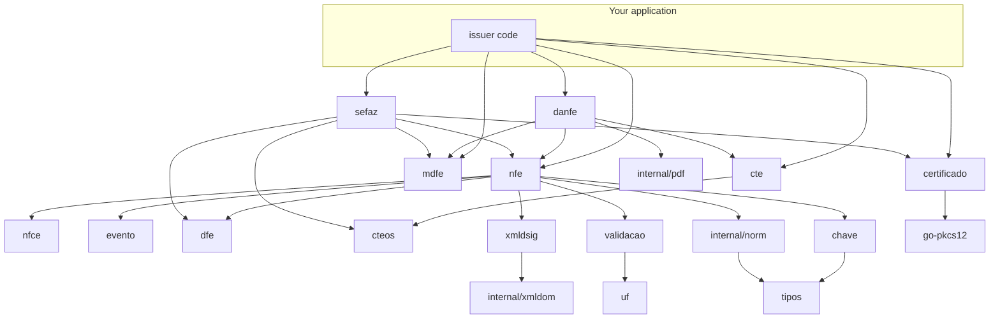

# Packages

The complete API reference is on
[pkg.go.dev](https://pkg.go.dev/github.com/mschunke/gonfe). This page describes
how responsibilities are divided and how the packages relate to one another.

## The map



No cycles, and the direction of the arrows tells the story: `tipos`, `uf` and
`chave` do not know what an NF-e is; `xmldsig` does not know what an A1
certificate is, only what a signer is; `cteos` reuses from `cte` everything the
two models share, instead of duplicating it.

The arrows at the top are about use, not imports — the diagram shows where you
enter the library, and below them, who depends on whom.

## Document core

### `nfe`

The data model of layout 4.00, mirroring the XSD field by field, plus the rules
that operate on it: computing totals, structural validation, generating the
access key, and assembling a batch and an `nfeProc`.

```go
n := nfe.Nova(nfe.ModeloNFe)
n.Preparar()          // normalises, computes totals, builds the key
n.Validar()           // nfe.Erros, one entry per inconsistency
n.XML()               // bytes ready to sign
n.AssinarCom(cert)    // shortcut: prepare + serialise + sign
```

### `nfce`

What is exclusive to the electronic consumer receipt: version 2 QR Code, lookup
URLs per state, and filling in the `infNFeSupl` group.

```go
nfce.PreencherSuplemento(n, nfce.Opcoes{CSC: csc})
nfce.ConferirQRCode(qr, csc.Codigo)
```

### `evento`

The lifecycle after authorisation: letter of correction, cancellation,
cancellation by replacement, the four recipient acknowledgements, and voiding of
number ranges. See [Events](eventos.md).

```go
evento.NovoCancelamento(evento.DadosCancelamento{ /* … */ })
evento.NovaCartaCorrecao(evento.DadosCartaCorrecao{ /* … */ })
evento.NovaInutilizacao(evento.DadosInutilizacao{ /* … */ })
```

### `dfe`

DF-e distribution: the queue of documents of interest to a CNPJ, indexed by NSU.
See [DF-e distribution](distribuicao.md).

## Transport

### `cte`

Conhecimento de Transporte model 57, layout 4.00: the cargo, the transported
documents, the freight components and the modals. See
[CT-e and MDF-e](transporte.md).

### `cteos`

CT-e Outros Serviços, model 67 — passenger transport, valuables transport and
excess baggage. It has its own root and imports from `cte` everything the two
share.

### `mdfe`

Manifesto de Documentos Fiscais model 58, layout 3.00, with the road modal and
the events for closing out a trip, cancellation and adding a driver.

## Auxiliary documents

### `danfe`

DANFE, NFC-e receipt, DACTE, DACTE OS and DAMDFE as PDFs, written in pure Go.
See [Auxiliary documents](danfe.md).

```go
danfe.Gerar(procNFe, danfe.Opcoes{})
danfe.GerarDACTE(procCTe, danfe.Opcoes{})
danfe.GerarDAMDFE(procMDFe, danfe.Opcoes{})
```

## Security

### `certificado`

A1 certificates in PKCS#12, extracting the ICP-Brasil identifiers and assembling
the TLS pair. No CGO.

```go
cert, _ := certificado.CarregarArquivo("cert.pfx", senha)
cert.CNPJ()
cert.DiasParaVencer()
cert.TLS()
```

It implements `xmldsig.Assinante` and `crypto.Signer`, so it serves directly as
a signing source.

### `xmldsig`

Signing and verification in the SEFAZ profile. It takes an interface, not a
concrete type, which lets you plug in A3, an HSM or remote signing.

```go
xmldsig.Assinar(documento, "infNFe", assinante)
xmldsig.AssinarTodos(lote, "infNFe", assinante)
xmldsig.Verificar(documento)
xmldsig.Certificado(documento)
```

## Communication

### `sefaz`

Endpoints by state, model and environment; a SOAP 1.2 client with mutual TLS;
and the operations for status, authorisation, receipt polling, lookup by key and
taxpayer registration lookup.

```go
cliente, _ := sefaz.NovoCliente(sefaz.Config{ /* … */ })
cliente.StatusServico(ctx)
cliente.Autorizar(ctx, lote)
cliente.EsperarProcessamento(ctx, recibo, 3*time.Second, 20)
cliente.ConsultarNFe(ctx, chave)
cliente.EnviarEvento(ctx, assinado)
cliente.ConsumirDFe(ctx, ultimoNSU, aoReceber)
```

The CT-e and the MDF-e have their own endpoints and service names, so they have
their own clients: `sefaz.NovoClienteCTe` and `sefaz.NovoClienteMDFe`. The CT-e
one serves both models — 57 and 67 — recognising which from the root element of
the signed document.

## Building blocks

### `tipos`

Fixed-point `Decimal`, `DataHora` with an explicit time zone, and `Data`. All
with XML and JSON serialisation. See [Decimal values](decimais.md).

### `chave`

The 44-digit access key: assembly, modulo-11 check digit, validation,
decomposition and formatting. It serves the NF-e, NFC-e, CT-e and MDF-e, because
the structure is the same.

### `validacao`

CPF, CNPJ (including the alphanumeric form) and state registration format, plus
formatters. Independent of `nfe`, usable anywhere in your system.

### `uf`

The 27 states: abbreviation, IBGE code, full name and legal time zone.

```go
uf.RS.Codigo()  // 43
uf.AM.Fuso()    // UTC-04:00
uf.Todas()      // all 27, alphabetically
```

## Internal packages

Not importable from outside the module, but worth knowing they exist:

- **`internal/xmldom`** — an XML tree that preserves namespace prefixes, with
  C14N 1.0 canonicalisation. It is what signing rests on.
- **`internal/norm`** — a reflection-based normaliser that applies the decimal
  scale and text cleanup declared in the field tags.
- **`internal/pdf`** — the PDF writer, base-14 fonts and Code 128, behind the
  auxiliary documents.
- **`internal/certtest`** — synthetic certificate generation for the tests.

## Stability

The library has not reached 1.0. Until it does, API changes may happen between
minor versions, always recorded in the
[CHANGELOG](https://github.com/mschunke/gonfe/blob/main/CHANGELOG.md). Pin the
version in your `go.mod` — which Go already does by default — and read the
changelog before upgrading.

After 1.0, compatibility will follow the usual Go rules: no breaking changes
within the same major version.
