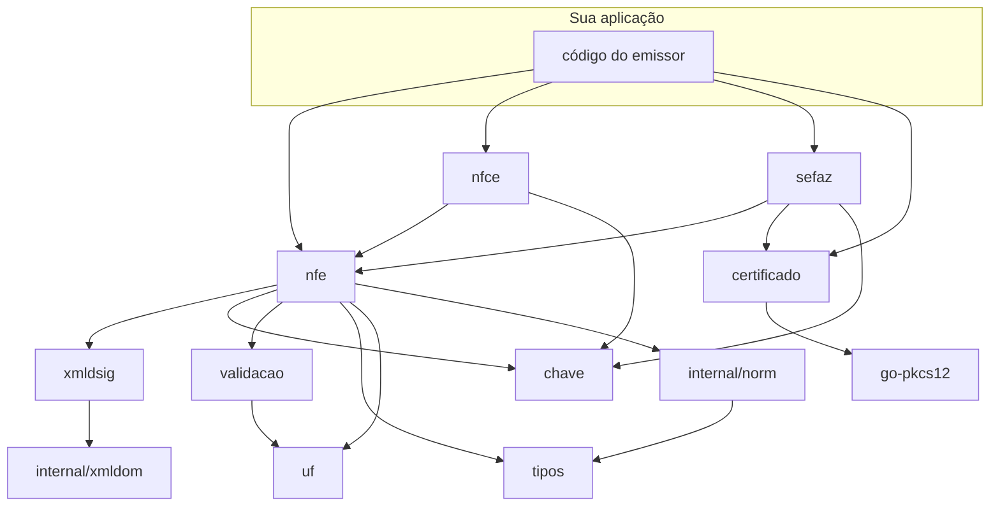

# Pacotes

A referência completa da API está no
[pkg.go.dev](https://pkg.go.dev/github.com/mschunke/gonfe). Esta página descreve
a divisão de responsabilidades e como os pacotes se relacionam.

## Mapa



Nenhum ciclo, e a direção das setas conta a história: `tipos`, `uf` e `chave`
não sabem o que é uma NF-e; `xmldsig` não sabe o que é um certificado A1, só o
que é um assinante.

## Núcleo do documento

### `nfe`

O modelo de dados do leiaute 4.00, espelhando o XSD campo a campo, mais as
regras que operam sobre ele: cálculo de totais, validação estrutural, geração da
chave de acesso, montagem de lote e de `nfeProc`.

```go
n := nfe.Nova(nfe.ModeloNFe)
n.Preparar()          // normaliza, calcula totais, monta a chave
n.Validar()           // nfe.Erros, um item por inconsistência
n.XML()               // bytes prontos para assinar
n.AssinarCom(cert)    // atalho: preparar + serializar + assinar
```

### `nfce`

O que é exclusivo do cupom eletrônico: QR Code versão 2, URLs de consulta por UF
e o preenchimento do grupo `infNFeSupl`.

```go
nfce.PreencherSuplemento(n, nfce.Opcoes{CSC: csc})
nfce.ConferirQRCode(qr, csc.Codigo)
```

## Segurança

### `certificado`

Certificados A1 em PKCS#12, com extração dos identificadores da ICP-Brasil e
montagem do par TLS. Sem CGO.

```go
cert, _ := certificado.CarregarArquivo("cert.pfx", senha)
cert.CNPJ()
cert.DiasParaVencer()
cert.TLS()
```

Implementa `xmldsig.Assinante` e `crypto.Signer`, então serve diretamente como
fonte de assinatura.

### `xmldsig`

Assinatura e verificação no perfil da SEFAZ. Recebe uma interface, não um tipo
concreto, o que permite plugar A3, HSM ou assinatura remota.

```go
xmldsig.Assinar(documento, "infNFe", assinante)
xmldsig.AssinarTodos(lote, "infNFe", assinante)
xmldsig.Verificar(documento)
xmldsig.Certificado(documento)
```

## Comunicação

### `sefaz`

Endereços por UF, modelo e ambiente; cliente SOAP 1.2 com TLS mútuo; as
operações de status, autorização, consulta de recibo, consulta por chave e
consulta de cadastro.

```go
cliente, _ := sefaz.NovoCliente(sefaz.Config{ /* … */ })
cliente.StatusServico(ctx)
cliente.Autorizar(ctx, lote)
cliente.EsperarProcessamento(ctx, recibo, 3*time.Second, 20)
cliente.ConsultarNFe(ctx, chave)
```

## Blocos de base

### `tipos`

`Decimal` de precisão fixa, `DataHora` com fuso explícito e `Data`. Todos com
serialização XML e JSON. Veja [Valores decimais](decimais.md).

### `chave`

A chave de acesso de 44 dígitos: montagem, dígito verificador módulo 11,
validação, decomposição e formatação. Serve NF-e, NFC-e, CT-e e MDF-e, porque a
estrutura é a mesma.

### `validacao`

CPF, CNPJ (inclusive alfanumérico) e formato de inscrição estadual, mais
formatadores. Independente do `nfe`, usável em qualquer parte do sistema.

### `uf`

Os 27 estados: sigla, código do IBGE, nome por extenso e fuso horário legal.

```go
uf.RS.Codigo()  // 43
uf.AM.Fuso()    // UTC-04:00
uf.Todas()      // as 27, em ordem alfabética
```

## Pacotes internos

Não são importáveis de fora do módulo, mas vale saber que existem:

- **`internal/xmldom`** — árvore XML com prefixos de namespace preservados e
  canonicalização C14N 1.0. É o que sustenta a assinatura.
- **`internal/norm`** — normalizador por reflexão que aplica a escala decimal e
  a limpeza de texto declaradas nas tags dos campos.
- **`internal/certtest`** — geração de certificados sintéticos para os testes.

## Estabilidade

A biblioteca ainda não chegou à versão 1.0. Até lá, mudanças na API podem
acontecer entre versões menores, sempre registradas no
[CHANGELOG](https://github.com/mschunke/gonfe/blob/main/CHANGELOG.md). Fixe a
versão no seu `go.mod` — o que o Go já faz por padrão — e leia o changelog antes
de atualizar.

Depois da 1.0, a compatibilidade seguirá as regras usuais do Go: nada de
mudanças incompatíveis dentro da mesma versão maior.
